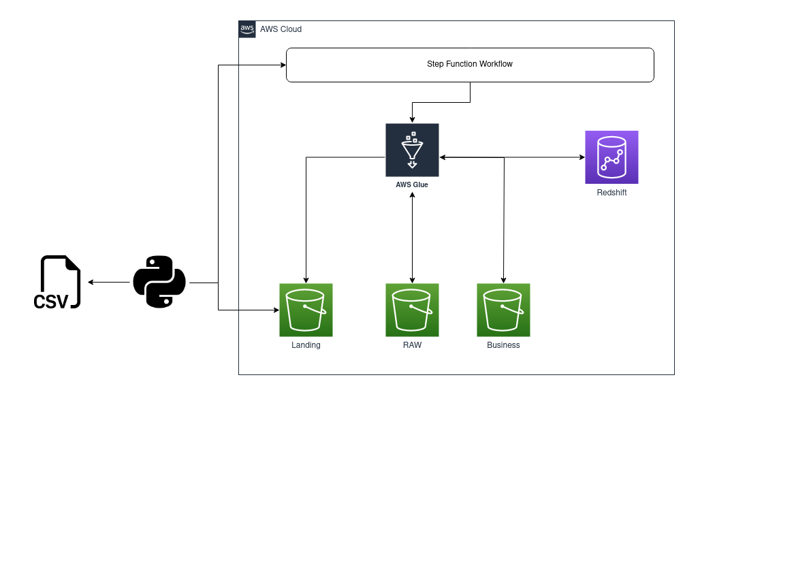
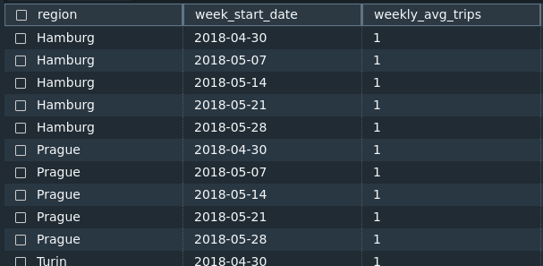
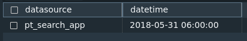
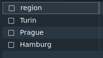

# Trips Challenge Project

This is the Trips Challenge project, a solution to a coding challenge provided by Jobsity.


## Prerequisites

In order to run this project, you will need to have the following installed and configured on your machine:


### Terraform
Terraform is an infrastructure as code tool used to create the AWS architecture. To install it, please follow the instructions from the official website:
 - https://www.terraform.io/downloads.html

### AWS CLI

The AWS CLI is a command-line tool that allows you to interact with AWS services. To install it, please follow the instructions from the official website:
insta
### Environment Variables

You will need to set your  `AWS_ACCESS_KEY_ID` and `AWS_SECRET_ACCESS_KEY` as environment variables. If you don't have them, you can create them by following the instructions from the AWS documentation:
- https://docs.aws.amazon.com/general/latest/gr/aws-sec-cred-types.html#access-keys-and-secret-access-keys

### Python

You will need Python 3.7 or higher installed on your machine. You can download it from the official website:
- https://www.python.org/downloads/

### Python Libraries

You will also need to install the following Python libraries:

```
pip install \
    boto3==1.26.81 \
    botocore==1.29.81 \
    jmespath==1.0.1 \
    python-dateutil==2.8.2 \
    s3transfer==0.6.0 \
    six==1.16.0 \
    urllib3==1.26.14
```

## Running the AWS Infrastructure

To run the AWS infrastructure, go to the infra folder and run the following commands:

`This step is only necessary if you want to set up the entire infrastructure. Otherwise, you can skip to the item  Running ETL.` 

```terraform
terraform init
terraform apply
```
This will create an the required infra to run this project.

## Running the ETL
To run the ETL process, go to the scripts/upload folder and execute the following command:
```
python upload_local_file_s3.py --path /path/file.csv
```
`Remeber to replace /path/file.csv with the path to your CSV file.` 

## [Infrastructure](infra)

The infrastructure for this project was developed using the Terraform tool, which allows for better management of resources and changes in the environment.

The infrastructure of this project consists of creating resources in AWS such as the [S3 bucket](infra/s3.tf) trips-datalake, which is used to store the transformed data. Additionally, the glue-job-etl-scripts bucket was created to store the ETL scripts.

A  [Redshift cluster](infra/redshift.tf) was also created, with database, user, and machine resource configurations set up for storing DW information after transformation. To complement the infrastructure, the [glue connection](infra/glue_conections.tf) resource was created, which allows the connection between the glue job and Redshift. In this specific case, some pre-existing network resources such as subnet and security groups were used.

[Policies and roles](infra/iam.tf) were then created for both the glue job and Step Function, granting permissions to access internal AWS resources such as S3, CloudWatch, Secret Manager, and more.

With these resources in place, the [glue jobs](infra/job_glue.tf) were created, which are responsible for running the data transformation scripts. In this component, it was necessary to configure resources and connections to meet the project's scenario.

Finally, the [Step Function](infra/step_function.tf) was created, which is responsible for orchestrating the data pipeline workflow.

## Architecture

The architecture is structured as follows: outside the AWS context, there is an application, in this case a [Python script](scripts/upload/upload_local_file_s3.py), which reads the source CSV file and uploads it to the AWS context, storing it in an S3 bucket in the landing layer. After finishing the upload of the CSV file to the S3 bucket, the application is responsible for triggering the Step Function, which orchestrates the workflow of the pipelines within the AWS context, firing the Glue jobs in the specified sequence in the workflow, which are responsible for reading, manipulating, transforming, and storing the data in the lake or in Redshift. Below you can see the overall project architecture.




### Workflow

After being triggered, the Step Function triggers a sequence of Glue jobs that follow the order specified in the workflow.

The first stage is the [raw_job](scripts/glue/move_raw.py), which is responsible for reading the CSV file, inferring the schema on the data, and saving it in Parquet format in the landing layer so that the other jobs can consume this information that has been previously treated.

The second stage runs two jobs in parallel and only starts after the successful completion of the [raw_job](scripts/glue/move_raw.py). The jobs that run in this stage are [dimregions_job](scripts/glue/dimregions.py) and [dimdatasources_job](scripts/glue/dimdatasources.py). These jobs read the information from the landing layer, make a distinct on the region and datasource information, respectively, and save it in Delta format. After this transformation occurs successfully, the same job is responsible for inserting the transformed information into their respective tables in Redshift: dimregions and dimdatasources.

Finally, we have the facttrips_job, which only starts after the completion of both [dimregions_job](scripts/glue/dimregions.py) and [dimdatasources_job](scripts/glue/dimdatasources.py). The [facttrips_job](scripts/glue/facttrips.py) reads both dims, reads the information from the landing layer, and transforms the data by joining with the dims and aggregating some information, also saving this data in Delta format. After the transformation is completed, the job also inserts the data into the fattrips table.

It is worth noting that each job is also responsible for feeding the trips_load table in Redshift, informing when the processing started and when it finished. This allows knowing which stage of the workflow it is in without the need to view the Step Function.

Below you can see the overall of Step Function Workflow.


## Scope of data

### Modeling Strategy

The data modeling approach for this project is based on the fact and dimension model, with a focus on the star schema design. This approach was chosen to maximize performance when querying data and building dashboards in the future.

In the star schema, one central fact table is connected to a set of dimension tables, each of which contains descriptive information about the data in the fact table. This approach simplifies complex queries and enables faster data retrieval.

By implementing this modeling strategy, was aimed to ensure that the data is structured in a way that facilitates efficient querying and analysis, and enables us to gain valuable insights from the data.


### [Move Raw Job](scripts/glue/move_raw.py)

The Move Raw process reads the CSV file that has been ingested into the data lake and is stored in the landing layer. It then infers the schema of the attributes in the file and converts the data to the Parquet format. Finally, it saves the transformed data in the raw layer of the data lake.

By converting the data to Parquet format, we can take advantage of its columnar storage format, which provides significant performance improvements over traditional row-based formats like CSV. Additionally, by storing the transformed data in the raw layer, we preserve the original data as it was received, enabling us to easily reprocess it if needed

### [Dimregions Job](scripts/glue/dimregions.py)

The Dimregions Job is responsible for creating and maintaining a Delta table called dimregions, which stores the distinct regions that the data may present. 

The job reads the Parquet data from the raw layer of the data lake and applies an incremental update process to the dimregions table. If a new region is identified in the data, it is inserted into the table, while existing records are discarded.

By creating a Delta table for the distinct regions in the data, we can easily and efficiently query and analyze the data. Additionally, by using an incremental update process, we can keep the dimregions table up to date with any new regions that may be added to the data in the future.


#### Schema
| Column Name | Description |
| ------ | ------ |
| cdregion | Unique code for each region record|
| region | Descriptive name of the region |

### [DimDataSource Job](scripts/glue/dimdatasources.py)

Similar to the DimRegions job, this job reads records from the raw layer and stores them in a Delta table called DimDataSource. This table is responsible for storing the distinct data sources that the data can present, meaning it is an incremental update process where, when there is a new data source, an insert is made, and when it is an existing one, the record is discarded. The job ensures that there is only one record for each data source in the table.

#### Schema
| Column Name | Description |
| ------ | ------ |
| cddatasource | Unique code for each datasource record|
| datasource | Descriptive name of the datasource |

### [Facttrips Job](scripts/glue/facttrips.py)

This process reads data from the raw layer and inserts it into the delta table "facttrips", which stores consolidated information about trips, grouped by region, data source, and datetime (considering only the hour of the day). Thus, it generates a quantity of trips performed at the same hour of the day, with the same data source, for the same region.

Although fact tables are not commonly incremental updates but rather appends, in this specific scenario, I chose to develop it as an incremental update since it will have loads during the day. This way, it is easier to ensure the integrity and performance of the load. However, it is essential to note that there is a caveat in this approach. The structure assumes that the CSV file submitted for the load does not contain duplicate information and that it is not submitted more than once. If this occurs, it will duplicate data in the fact table. Since there was no information on how the data would be obtained, I chose not to handle it in the fact table. In this scenario, it would be more appropriate to treat this information when obtaining it.

#### Schema
| Column Name | Description |
| ------ | ------ |
| cddatasource | Unique code for each datasource record|
| datasource | Descriptive name of the datasource |
| datetime | Date of the trip (considering only the hour of the day) |
| count_trips | Number of the trips made at the same hour of the day, with the same data source, for the same region |

It is worth noting that the final view of the fact table does not include the coordinates fields, as they do not add any value to the final result, and can even impair performance when extracting data. However, if the data science team or any other team needs to use this information, they can access it in the raw layer.

## Monitoring

In terms of load monitoring, a trips_load table was created to store the status of each step in the workflow, including start and end logs. This enables the creation of a dashboard that provides real-time load status updates. Since it also includes the time taken for each step, it can even be used for performance analysis over time.

#### Schema
| Column Name | Description |
| ------ | ------ |
| hashid | Unique code for each workflow |
| datetime | timestamp of input status |
| comments | Description of status |

## Retriving data from tables

### [Weekly Avarage Trips](scripts/redshift/sql/weekly_avg_trips.sql)

The purpose of this query is to verify the average number of trips to a specific region during the week.

```
SELECT reg.region, 
       trunc(date_trunc('week', trp.datetime)) AS week_start_date, 
       AVG(trp.count_trips) AS weekly_avg_trips
FROM trips.facttrips trp
left join trips.dimregions reg on reg.cdregion = trp.cdregion
GROUP BY reg.region, week_start_date
ORDER BY reg.region, week_start_date;
```

Sample of retrive data



### [Latest Datasource](scripts/redshift/sql/latest_datasource.sql)

The purpose of this query is to retrive the latest datasource from two most commonly appearing regions.

```
with commun_regions as(
  SELECT 
    reg.cdregion, 
    reg.region, 
    count(*) as row_count 
  FROM 
    trips.facttrips trp 
    left join trips.dimregions reg on reg.cdregion = trp.cdregion 
  group by 
    reg.cdregion, 
    reg.region 
  order by 
    row_count desc 
  limit 
    2
) 
select 
  dts.datasource, 
  max(trp.datetime) as datetime 
FROM 
  trips.facttrips trp 
  left join trips.dimdatasources dts on dts.cddatasource = trp.cddatasource 
  inner join commun_regions cr on cr.cdregion = trp.cdregion 
group by 
  dts.datasource 
order by 
  datetime desc 
limit 
  1
```

Sample of retrive data



### [Cheap Mobile](scripts/redshift/sql/cheap_mobile.sql)

The purpose of this query is to identify the regions where the cheap mobile has appeared.

```
select distinct reg.region
FROM trips.facttrips trp
left join trips.dimregions reg on reg.cdregion = trp.cdregion 
left join trips.dimdatasources dts on dts.cddatasource = trp.cddatasource  and 
                                      lower(dts.datasource) = 'cheap_mobile';
```

Sample of retrive data

