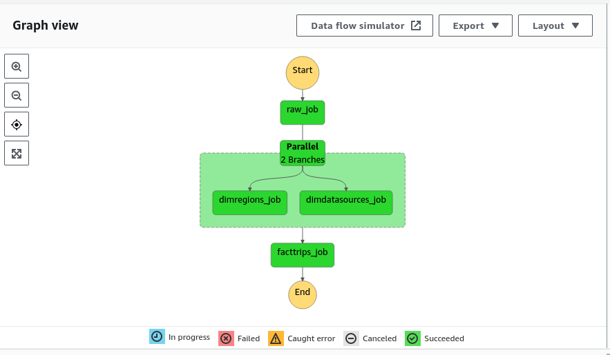

# Trips Challenge Project

This is the Trips Challenge project, a solution to a coding challenge provided by Jobsity.


## Prerequisites

In order to run this project, you will need to have the following installed and configured on your machine:


### Terraform
Terraform is an infrastructure as code tool used to create the AWS architecture. To install it, please follow the instructions from the official website:
 - https://www.terraform.io/downloads.html

### AWS CLI

The AWS CLI is a command-line tool that allows you to interact with AWS services. To install it, please follow the instructions from the official website:
insta
### Environment Variables

You will need to set your  `AWS_ACCESS_KEY_ID` and `AWS_SECRET_ACCESS_KEY` as environment variables. If you don't have them, you can create them by following the instructions from the AWS documentation:
- https://docs.aws.amazon.com/general/latest/gr/aws-sec-cred-types.html#access-keys-and-secret-access-keys

### Python

You will need Python 3.7 or higher installed on your machine. You can download it from the official website:
- https://www.python.org/downloads/

### Python Libraries

You will also need to install the following Python libraries:

```
pip install \
    boto3==1.26.81 \
    botocore==1.29.81 \
    jmespath==1.0.1 \
    python-dateutil==2.8.2 \
    s3transfer==0.6.0 \
    six==1.16.0 \
    urllib3==1.26.14
```

## Running the AWS Infrastructure

To run the AWS infrastructure, go to the infra folder and run the following commands:

```terraform
terraform init
terraform apply
```
This will create an the required infra to run this project.

## Running the ETL
To run the ETL process, go to the scripts/upload folder and execute the following command:
```
python upload_local_file_s3.py --path /path/file.csv
```
`Remeber to replace /path/file.csv with the path to your CSV file. ` 

This process will upload the CSV to S3 and invoke the Step Function, the workflow orchestrator responsible for triggering the ETLs that process the data.



## Authors
- Geovani Leitão - gLeitao

## License

This project is licensed under the MIT License - see the LICENSE file for details.